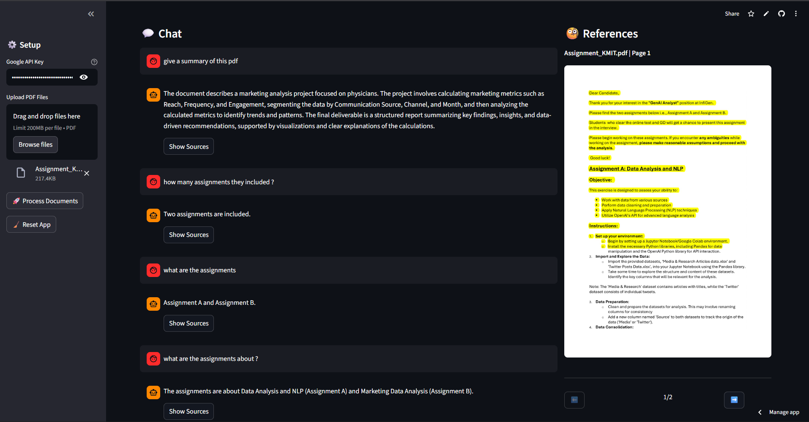

# 🤖 AI-Powered PDF Assistant

A local **Retrieval-Augmented Generation (RAG)** application that allows you to chat with your PDF documents. Built with **Streamlit**, **LangChain**, and **Google Gemini**.



## 🌟 Key Features

* **Smart Source Filtering:** Unlike standard RAG apps, this uses a two-step AI process. It first retrieves broad context, then uses a specialized AI step to filter out irrelevant passages before answering.
* **Visual Evidence:** When the AI answers, it provides **Visual Citations**. Click "Show Sources" to see the exact PDF page with the relevant text **highlighted in yellow**.
* **Gemini 2.0 Powered:** Utilizes Google's latest `gemini-2.0-flash` for reasoning and `text-embedding-004` for high-quality search.
* **Free-Tier Friendly:** Includes intelligent rate-limiting and batch processing to prevent `429 Quota Exceeded` errors on the Gemini free tier.
* **Multi-Document Support:** Upload and query multiple PDFs simultaneously.

---

## 🛠️ How It Works

This application follows a strict **"No Hallucination"** pipeline:

1.  **Ingestion:** PDFs are uploaded, text is extracted using `PyMuPDF`, and split into 1000-character chunks.
2.  **Embedding:** Text chunks are converted into vectors using `text-embedding-004` (processed in batches with sleep timers to respect API limits).
3.  **Vector Search:** When you ask a question, `FAISS` retrieves the top 15 most similar text chunks.
4.  **AI Filtering (The Smart Step):** **Gemini 2.0 Flash** reviews the 15 chunks and discards the ones that aren't actually relevant to your specific question.
5.  **Synthesis:** The remaining validated chunks are sent to the AI to generate the final answer.
6.  **Visual Rendering:** The app uses metadata to locate the original page and renders an image with coordinates of the used text highlighted.

---

## 🚀 Installation & Setup

### Prerequisites
* Python 3.10 or higher.
* A Google Cloud API Key ([Get one here](https://aistudio.google.com/)).

### 1. Clone the Repository
```bash
git clone [https://github.com/Karthik3116/RAG_BOT.git](https://github.com/Karthik3116/RAG_BOT.git)
cd RAG_BOT